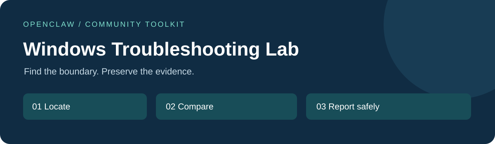
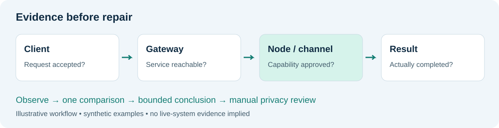

<p align="center"></p>
<p align="center"><strong>A focused skill, an offline redaction helper, and evidence-first troubleshooting recipes.</strong><br><sub>Private review · MIT · Python 3.9+ · PowerShell 5.1+ · Not affiliated with OpenClaw</sub></p>

| New to OpenClaw? | Have a failure? | Build / contribute |
| --- | --- | --- |
| [中文五步入门](docs/GETTING_STARTED.zh-CN.md) | [Choose a boundary](references/triage.md) | [Developer guide](docs/DEVELOPER_GUIDE.md) |

<p align="center"></p>

## Try the tool without OpenClaw or credentials

Run from the downloaded repository in PowerShell:

```powershell
./scripts/collect_openclaw_diagnostics.ps1 -SelfTest
./scripts/collect_openclaw_diagnostics.ps1 -InputPath examples/synthetic-diagnostic.txt -OutputPath openclaw-diagnostics-demo.txt
```

Expected: self-test PASS, then a new sanitized file. Compare [the input and expected output](examples/README.md). The output is ignored by Git and never uploaded automatically.

**The helper is now offline-only.** Despite its historical filename, it does not run OpenClaw, probe services, read configuration, or repair your system. It refuses to overwrite an existing output. Automatic redaction still needs human review.

## Pick your symptom

| Symptom | Guide |
| --- | --- |
| Gateway offline or dashboard disconnecting | [First-pass triage](references/triage.md) |
| A command runs on the wrong host | [Gateway and node routing](references/gateway-node.md) |
| `system.run`, timeout, or DACL error | [Windows execution boundary](references/windows-sandbox.md) |
| WSL can reach a proxy but requests still fail | [Network comparison](references/wsl-network.md) |
| Telegram send succeeds but phone stays silent | [Delivery versus notification](references/telegram-delivery.md) |

## Install the companion skill

Review [SKILL.md](SKILL.md), then:

```text
openclaw skills install git:jakemorgan-research/openclaw-windows-troubleshooting-lab@main
```

Private access is required. A checked-out copy supports `openclaw skills install .`. Use a reviewed commit instead of `main` for reproducibility; reinstall Git sources to update. [Official installation guide](https://github.com/openclaw/openclaw/blob/main/docs/tools/skills.md#installing-from-clawhub).

Try asking:

> Find the first failing boundary in this sanitized case. Separate confirmed evidence from hypotheses; propose one comparison check without modifying my system.

<details>
<summary><strong>What you get at the end</strong></summary>

A small report with symptom, boundary, expected/observed results, evidence strength, one next check, and a stop condition. See the [worked synthetic case](examples/sanitized-case-report.md) and [blank template](references/case-report.md).

The helper writes a local redacted text copy, not a diagnosis or a guaranteed-safe public report.
</details>

<details>
<summary><strong>Privacy, tests, and feedback</strong></summary>

Do not commit raw logs, private configuration, tokens, contacts, machine names, IPs, session IDs, original project files, or account screenshots. Synthetic examples are not records from a real user device.

[Verification status](docs/VERIFICATION.md) · [Developer guide](docs/DEVELOPER_GUIDE.md) · [Contributing](CONTRIBUTING.md) · [Security](SECURITY.md) · [License](LICENSE)
</details>
